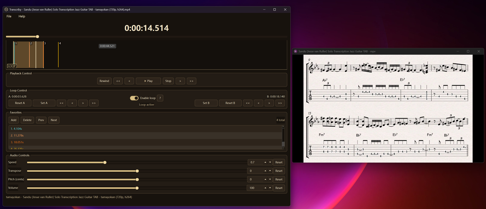
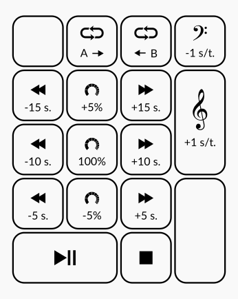

# Transcriby

**Transcriby** is a simple audio player with speed/pitch change capabilities. It is meant to help music students/teachers transcribe music and play along with it.
It is also an open-source alternative for Transcribe!-style transcription workflows.

- **Cross-platform**: Works on Windows, Linux, and macOS
- **Lightweight**: Uses `mpv` (libmpv) for audio playback (no GStreamer required)

Transcriby is an independent project and is not affiliated with or endorsed by Seventh String Software.

**Made by a musician for musicians**



## About This Fork

This project is modified from the original [SlowPlay](https://github.com/aFunkyBass/slowplay).
Current maintained repository: [SeanTong11/transcriby](https://github.com/SeanTong11/transcriby).

**Key changes in this fork:**
- ✅ **Removed GStreamer dependency** - Now uses `mpv` (libmpv) on all platforms
- ✅ **Full Windows support** - Native Windows support without complex setup
- ✅ **Simplified installation** - No need to install GStreamer or its plugins

## Features

- [Speed and pitch change on the fly](#speed-and-pitch-change)
- [Video playback in a synced external window](#speed-and-pitch-change)
- [Loop a range of the song, with fine adjustment of boundaries](#loop-ab)
- [Timeline marker bar with click-to-seek](#timeline-marker-bar)
- [Favorites and quick timestamp markers](#favorites-and-session-files)
- [Session files (`.tby`) for full restore](#favorites-and-session-files)
- [Modified audio export in MP3 or WAV audio format](#export-modified-audio)
- [No nonsense keyboard shortcuts](#optimized-keyobard-shortcuts)
- [...and more!](#other-features)

### Speed and pitch change:

**Transcriby** can speed down/up songs or change their pitch independently "on the fly". You can import all the most common audio files format (mp3, wav, flac, aif...).
It also supports video files like mp4/m4v/mkv, which will open in a separate mpv window while the audio controls stay in Transcriby.

Speed change is made by moving the slider in 0.1x steps, or by entering the precise value in the edit box (for example `0.9`). The slider is visually centered at `1.0x`; effective speed is clamped to `0.1x .. 2.0x`. You can transpose your song up and down by semitones or fine adjust the pitch by cents, in case the song is not in tune with your instruments. For your convenience, Transcriby offers several numeric keypad shortcuts. Please take a look at the [shortcut](#optimized-keyobard-shortcuts) list further on in this document.

### Loop A/B:

This function allows you to loop playback a section of the song. Loop controls are available directly in the main playback panel.

Use the "Set loop start" (shortcut "A" or num keypad divide) and "Set loop end" (shortcut "B" or num keypad multiply) buttons while playing to mark the loop boundaries. Toggle the "Enable loop" switch (shortcut "L") to engage/disengage loop playing. You can reset the A/B point using the reset buttons or pressing "Ctrl+A" and "Ctrl+B" on your keyboard.

To achieve maximum execution precision, you can fine adjust the loop points by moving them left and right by 10 or 100 milliseconds using the associated buttons. *NOTE: Please keep in mind that there can be very short silence gap when restarting the loop. This is normal and it can't be avoided*

### Timeline marker bar:

Transcriby includes a timeline marker bar under the seek bar:

- Click anywhere on the timeline to seek playback to that point
- A/B loop boundaries are shown directly on the timeline
- Favorite markers are shown directly on the timeline
- The playhead updates in real time while playing
- Right-click drag on timeline or seek/progress area to set a loop range quickly

### Favorites and session files:

Transcriby provides timestamp favorites directly in the Playback panel:

- Add a favorite at the current playhead position
- Jump to previous/next favorite quickly
- Delete the selected favorite (or the latest one when none is selected)
- Favorites auto-number by time order and keep stable per-item colors
- Favorite markers are also displayed on the timeline bar

You can also save/restore complete playback sessions with `.tby` files:

- Current media path
- Speed, transpose, pitch cents, volume
- Loop A/B start/end and loop enabled state
- Current playback position
- Favorite timestamps and colors

### Export modified audio:

It is possible to export modified songs by using the "Save as..." button. You can save your files either in mp3 or wav format, based on the extension of file to be saved. Currently saved audio files are in the format of 44.1K 16bit stereo. Mp3 are saved as constant bitrate 192k. Volume setting and metadata are ignored in the export operation.

### Optimized keyobard shortcuts:

If you use Transcriby for music practicing, you probably want access its functions without using the mouse or both hands, which is why most important shortcuts are assigned to the numeric keypads.

- Numbers in the left column (1, 4, 7) move the song position back by 5, 10 and 15 seconds. Numbers on the right column (3, 6, 9) move it forward accordingly. You can reach the song position you want to reharse in a bit.

- Speed controls are assigned to the central column. Numbers 2 and 8 change speed by `-0.1x` and `+0.1x` respectively, while number 5 resets the speed to normal.

- Plus and minus keys transpose the song by semitones

- Loop start and loop end can be set using the Divide and the Multiply keys respectively

- Number 0 start and pause the playback while the Dot stop and rewind.
- Spacebar restarts playback from loop start (A) when loop is enabled, otherwise it toggles play/pause.

I highly recommend taking some time to familiarize yourself with these keyboard shortucts, as they will save you a lot of time in the long run! Personally, I've been using this key combination for my music classes for a while now, and I can't think of anything better.

See the [shortcuts](#shortcuts) section for a more complete key reference.

### Other features:

- **Recent files list**: To access the recent files list use the **Ctrl+R** shortcut, or right-click on the "Open" button. Transcriby keeps track of the last 16 media files.
Opening a regular media file always starts with clean/default playback values.
Full playback restore (speed/pitch/loop/favorites/position) is done only from `.tby` session files.
On startup, Transcriby tries to load the last `.tby` session first; if unavailable, it falls back to the last played media file.

- **Drag-n-drop**: you can drop audio files straight from your file manager or from other applications.

## Installation

### Prerequisites

- **Python 3.9 or higher**
- **uv** - Fast Python package manager (install from [astral.sh/uv](https://astral.sh/uv))
- **mpv** runtime (for audio playback)

**mpv runtime install:**
- **Windows**: Download from https://mpv.io/installation/ and ensure `mpv.exe` plus `libmpv*.dll` are on PATH (or next to the app)
- **macOS**: `brew install mpv` (installs `libmpv.dylib`)
- **Ubuntu/Debian/WSL**: `sudo apt-get install libmpv2`
- **Fedora**: `sudo dnf install mpv`
- **Arch**: `sudo pacman -S mpv`

**Tip (Windows):** If `python-mpv` cannot find libmpv, set `TRANSCRIBY_MPV_DIR` to the folder containing `libmpv*.dll` (for example the same folder as `mpv.exe`).
**Tip (macOS/Linux):** The critical dependency is the `libmpv` shared library. If auto-detection fails, set `MPV_LIBRARY` to the full library path (for example `/opt/homebrew/lib/libmpv.dylib`, `/usr/local/lib/libmpv.dylib`, or `/usr/lib/x86_64-linux-gnu/libmpv.so.2`).

### Quick Start with uv

[uv](https://github.com/astral-sh/uv) is a fast Python package manager written in Rust. It's the recommended way to install and run Transcriby.

#### Windows

```cmd
git clone https://github.com/SeanTong11/transcriby.git
cd transcriby

# Create venv and install dependencies
uv sync

# Run the application
uv run transcriby

# Or activate the environment and run normally
.venv\Scripts\activate
transcriby
```

#### Linux / WSL

```bash
git clone https://github.com/SeanTong11/transcriby.git
cd transcriby

# Create venv and install dependencies
uv sync

# Run the application
uv run transcriby

# Or activate the environment and run normally
source .venv/bin/activate
transcriby
```

#### macOS

```bash
brew install mpv

# If python-mpv cannot locate libmpv automatically:
# export MPV_LIBRARY=/opt/homebrew/lib/libmpv.dylib  # Apple Silicon
# export MPV_LIBRARY=/usr/local/lib/libmpv.dylib     # Intel

git clone https://github.com/SeanTong11/transcriby.git
cd transcriby

uv sync
uv run transcriby
```

### Development Setup

To install with all development dependencies:

```bash
uv sync --dev
```

### Qt UI

Transcriby now runs on a single PySide6 frontend.

Run it with:

```bash
uv run transcriby
# or
uv run transcriby-qt
# or
uv run python -m transcriby.qt_main
```

Current Qt feature set includes:
- Open media + Open Recent
- Open Recent dialog (`Ctrl+R`)
- Drag and drop local files
- Drag and drop `.tby` session files
- Save As audio export
- Open/Export `.tby` sessions
- Startup restore (last `.tby` session first, then last media)
- Loop A/B controls and restart-from-A behavior
- Timeline overlay with playhead + favorites markers
- Timeline hover time tooltip + marker click-to-jump
- Loop A/B fine adjust buttons (`10ms` / `100ms`)
- Timeline right-click menu: set loop start/end at cursor
- Loop-enabled indicator on Play button
- Right-drag on timeline to set loop A/B range
- Open button right-click opens Recent dialog
- Shortcuts help dialog (`F1`) and `.tby` export shortcut (`Ctrl+Shift+S`)
- Favorites add/delete/jump with keyboard shortcuts

### Windows Build

1. Download a pinned shinchiro `mpv-dev` package (example tag `20260303`) from:

```cmd
https://github.com/shinchiro/mpv-winbuild-cmake/releases/tag/20260303
```

2. Extract the archive and set mpv DLL directory for packaging
   (the folder that contains `libmpv*.dll`):

```cmd
set TRANSCRIBY_MPV_DIR=C:\path\to\mpv-dev\folder\with\dlls
```

3. Run:

```cmd
powershell -ExecutionPolicy Bypass -File tools\package_windows.ps1
```

### Legacy pip Setup (Not Recommended)

If you prefer not to use uv:

```bash
python -m venv .venv
source .venv/bin/activate  # Windows: .venv\Scripts\activate
pip install -r requirements.txt
python -m transcriby.qt_main
```

## Shortcuts

Transcriby offers the following shortcuts:

#### General operations:
- **Ctrl+O**: Open a file
- **Ctrl+R**: Open recent files list
- **Ctrl+Q**: Quit application

#### Playback controls:
The following commands are all assigned to the numeric keypad. Refer to the drawing below for visual help.

- **0** *(numeric keypad)*: Toggle Play/Pause
- **spacebar**: Restart from loop start (A) when loop is enabled, otherwise Toggle Play/Pause
- **.** *(numeric pad dot)*: Stop and Rewind

- **HOME**: Rewind to the start of song, or to the start of loop when engaged

- **1** or **left arrow**: Rewind 5 seconds
- **4**: Rewind 10 seconds
- **7**: Rewind 15 seconds

- **3** or **right arrow**: Forward 5 seconds
- **6**: Forward 10 seconds
- **9**: Forward 15 seconds

- **8**: Increase speed by `0.1x`
- **2**: Decrease speed by `0.1x`
- **5**: Reset speed to 100%

- **M**: Add favorite at current position
- **Shift+M** (or **M** with uppercase): Delete selected/latest favorite
- **Ctrl+[**: Jump to previous favorite
- **Ctrl+]**: Jump to next favorite

- **+**: Transpose +1 semitone
- **-**: Transpose -1 semitone

#### Loop controls:
- **L**: Toggle loop playing

- **A** or **Keypad Divide**: Sets the start loop point to the current playing position
- **Ctrl+A**: Resets the start loop point to the start of the song

- **B** or **Keypad Multiply**: Sets the end loop point to the current playing position
- **Ctrl+B**: Resets the end loop point to the end of the song



*(please make sure none of the input boxes have the focus. Click on an empty area of the app to take the focus back from an input box)*

## Export Notes

Audio export is performed with `soundfile + scipy` and does not require ffmpeg.

## Troubleshooting

### "No audio device found"
- Make sure your audio drivers are installed
- Check system sound settings to ensure an output device is selected

### Audio sounds choppy or distorted
- Close other applications using audio
- Try increasing the buffer size (edit `player.py` and change `DEFAULT_BLOCK_SIZE`)

### Windows exe icon does not look updated
- Rebuild from project root so `transcriby/resources/Icona.ico` is included
- Unpin and re-pin the app from taskbar
- If needed, restart Explorer (`explorer.exe`) to refresh Windows icon cache
- Helper script: `powershell -ExecutionPolicy Bypass -File tools\\refresh_windows_icon_cache.ps1`

### "Module not found" error
- Make sure you installed all requirements: `pip install -r requirements.txt`
- Ensure your virtual environment is activated

### "PortAudio library not found" (Linux/WSL)
- This project no longer uses PortAudio. If you see this error, you are running an old build.

## Credits

- Original [SlowPlay](https://github.com/aFunkyBass/slowplay)
- Inspired by [Play It Slowly](https://github.com/jwagner/playitslowly) by Jonas Wagner

## License

This project is licensed under the GNU General Public License v3.0 (GPL-3.0).
See [COPYING](COPYING) for details.
